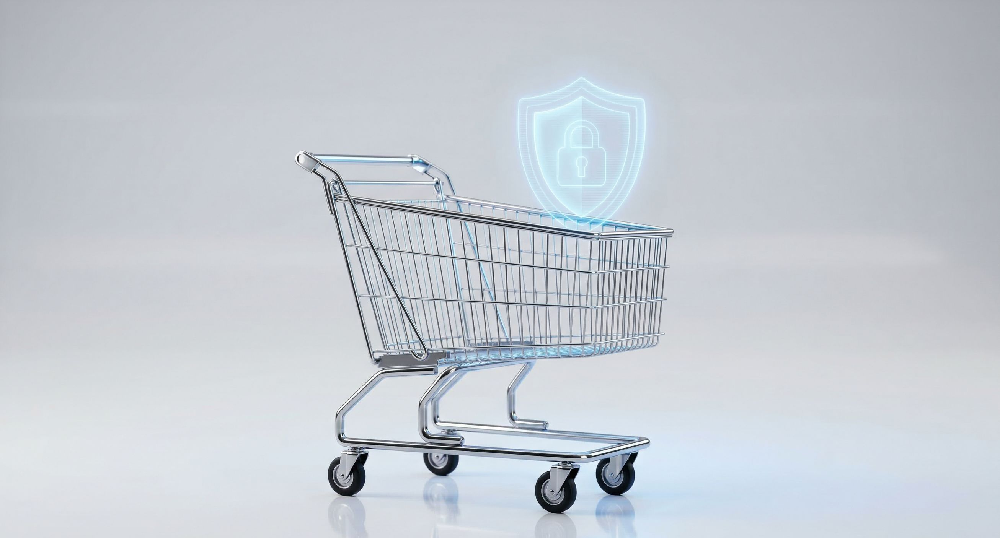

Has invertido presupuesto en publicidad, optimizado tus redes sociales y logrado que los usuarios lleguen a tu tienda online. Navegan por tus productos, añaden artículos al carrito, van a la página de pago y... desaparecen. 

Si este escenario te resulta familiar, no estás solo. Para los dueños de negocios B2B y minoristas por igual, el abandono del carrito de compras es uno de los mayores puntos de dolor en el comercio electrónico. 

> Según estudios de la industria, la tasa promedio de abandono de carritos en ecommerce ronda un asombroso 70%. Esto significa que de cada 10 clientes que están listos para comprar, 7 se van sin dejar un centavo.

La buena noticia es que **la mayoría de estos abandonos son prevenibles**. No se trata de que tu producto sea malo o demasiado caro; en la inmensa mayoría de los casos, el problema radica en la experiencia digital que estás ofreciendo. 

A continuación, desglosamos los verdaderos culpables de esta fuga de capital y cómo la tecnología moderna puede solucionarlos.

## 1. El asesino silencioso de las ventas: Una web lenta

Vivimos en la era de la inmediatez. Cuando un cliente corporativo o un consumidor final decide hacer una compra, su paciencia es mínima. **Si tu tienda tarda más de 3 segundos en cargar, estás perdiendo automáticamente a más de la mitad de tus compradores potenciales.**

Una arquitectura web deficiente, imágenes pesadas sin optimizar o un código sobrecargado hacen que el navegador del usuario tenga que esforzarse demasiado. En términos técnicos, esto se traduce en un mal rendimiento del frontend (la parte visual de tu web) y tiempos de respuesta lentos del backend (el servidor). 

**La solución:**
Necesitas una tienda construida con tecnologías modernas que prioricen el rendimiento (como la carga diferida de imágenes o la generación de sitios estáticos). **Una web rápida no solo mejora la experiencia del usuario, sino que es fundamental para el SEO**, permitiéndote rankear mejor en Google y reducir tus costos de adquisición de clientes.

## 2. Falta de transparencia y "Costos Sorpresa"

Nada arruina más rápido la confianza de un comprador que llegar a la pantalla final de pago y descubrir que el total es significativamente mayor debido a impuestos ocultos, tarifas de gestión o **costos de envío inesperados**.

Este es un problema clásico de Diseño de Experiencia de Usuario (UX). Si el usuario siente que lo están engañando o que le están ocultando información vital, su reacción instintiva será cerrar la pestaña. 

**La solución:**
Implementa calculadoras de envío dinámicas en la propia página del producto o en el primer paso del carrito. **La honestidad visual y financiera desde el primer clic genera una confianza invaluable** y previene el impacto negativo en el momento crucial del checkout.

## 3. Un proceso de pago lleno de fricción

¿Obligas a tus usuarios a crear una cuenta antes de poder comprar? Si es así, estás levantando un muro de ladrillos frente a tu caja registradora. **Obligar al registro es una de las principales causas de frustración y abandono.**

Además, un formulario de pago interminable, donde el cliente tiene que introducir datos redundantes o navegar por tres pantallas distintas, agota la motivación de compra. En el entorno B2B, donde los compradores suelen tener poco tiempo, un proceso ineficiente es inaceptable.

### Estrategias para un Checkout sin fricciones:
* **Habilitar la "Compra como Invitado" (Guest Checkout):** Permite que el usuario pague solo con su correo electrónico y datos de envío. Podrás ofrecerle crear una cuenta *después* de que la venta esté asegurada.
* **Autocompletado de direcciones:** Integra APIs que sugieran y completen automáticamente la dirección postal del cliente basándose en su código postal, ahorrándole valiosos segundos.
* **Múltiples opciones de pago:** Desde tarjetas de crédito corporativas hasta billeteras digitales (Apple Pay, Google Pay). Cuantas menos barreras existan entre la intención y la transacción, mejor.

## 4. Diseño que no inspira seguridad

En el mundo digital, tu sitio web es la vitrina y el vendedor al mismo tiempo. Si la página de pago parece desactualizada, tiene enlaces rotos, o carece de indicadores de seguridad (como el candado SSL o los sellos de garantía de pago), **el cliente sentirá un riesgo real al introducir los datos de su tarjeta de crédito**.

> El 18% de los compradores abandona el carrito simplemente porque "no confiaba en el sitio con la información de su tarjeta de crédito".

**La solución:**
El diseño visual debe transmitir autoridad y pulcritud corporativa. Un diseño limpio, moderno y estructurado, respaldado por una infraestructura tecnológica robusta, comunica subliminalmente que tu empresa es seria, estable y segura.

