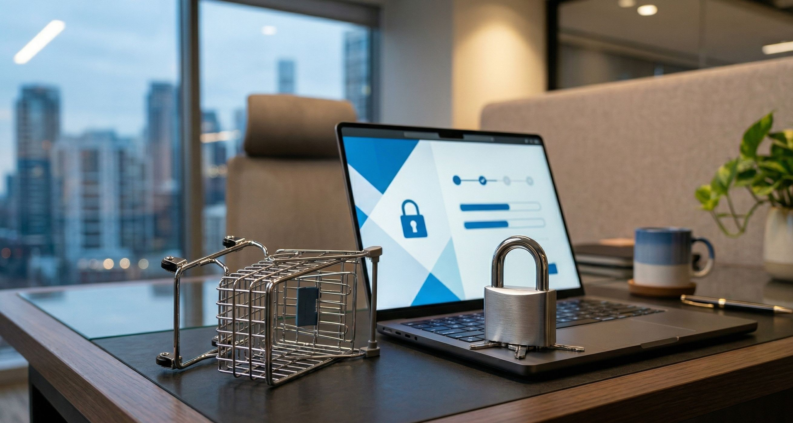

Has decidido dar el gran paso: es hora de que tu empresa tenga una presencia profesional en internet. Hablas con conocidos, buscas en Google y, de repente, te encuentras sepultado bajo una avalancha de términos incomprensibles: servidores, DNS, propagación, ancho de banda, FTP y bases de datos. 

Es abrumador. Como dueño de negocio, tu tiempo es oro y tu objetivo es vender más, no convertirte en ingeniero de sistemas de la noche a la mañana. 

Respira profundo. En este artículo, vamos a desmitificar los dos conceptos más fundamentales para tener una página web, y lo haremos sin usar ni una sola palabra técnica complicada. Te prometo que, en los próximos cinco minutos, entenderás perfectamente cómo funciona internet para tu negocio.

## El Dominio: La dirección de tu negocio en internet

Empecemos por lo primero que tus clientes ven: el nombre de tu página web. Un **dominio** (como `tuempresa.com`) es simplemente el nombre exclusivo que identifica a tu marca en internet. 

> **La analogía inmobiliaria:** Imagina que vas a abrir una nueva sucursal física para tu negocio. El **dominio** es exactamente igual a la **dirección postal** (por ejemplo, Avenida Siempreviva 123). Es la dirección exacta que tus clientes escriben en su GPS o le dicen al taxista para poder encontrarte. En internet, es lo que escriben en la barra superior del navegador.

Elegir un buen nombre de dominio es una decisión de negocios estratégica. Debe ser fácil de recordar, fácil de pronunciar y representar fielmente a tu marca. 

*   **Extensiones globales (.com):** Son el estándar mundial. Transmiten autoridad y son ideales si planeas vender internacionalmente.
*   **Extensiones regionales (.com.ar, .es, .mx):** Son excelentes para conectar con tu audiencia local y decirle a Google exactamente en qué país operas.

Si no tienes un dominio propio, básicamente eres "un fantasma" en el mundo digital. Es el primer paso para construir una marca sólida y memorable.

## El Hosting (Alojamiento): El terreno virtual

Ahora que tienes una "dirección" (tu dominio), necesitas un lugar físico donde poner las cosas de tu negocio. Aquí es donde entra el **hosting** o alojamiento web.

Tu página web no es más que una colección de archivos: fotos, textos, videos y códigos que le dan forma y color. Todos esos archivos necesitan vivir en una computadora superpotente que esté encendida las 24 horas del día, los 365 días del año. A esa computadora se le llama servidor, y alquilar un espacio en ella es lo que conocemos como pagar un hosting.

> **La analogía inmobiliaria:** Si el dominio es la dirección de tu local, el **hosting** es el **terreno** que has comprado o alquilado en esa dirección exacta. Y tu **página web** (el diseño, las fotos, los productos) es **la casa o el edificio** que construyes sobre ese terreno.

Sin terreno (hosting), no tienes dónde construir. Sin dirección (dominio), nadie puede encontrar tu terreno. Ambas cosas son absolutamente indispensables para existir en internet.

## El peligro de lo "gratis" o demasiado barato

Es tentador buscar atajos para ahorrar costos, especialmente cuando recién empezamos. Muchas plataformas ofrecen crear tu página web "gratis", pero a cambio, te obligan a usar lo que se llama un subdominio. 

El resultado es una dirección que se ve así: `www.tuempresa.plataforma-gratis.com`. 

Piensa en esto como empresario: ¿Qué impresión te daría un abogado o un consultor que te entrega una tarjeta de presentación con un correo que termina en `@hotmail.com` o una web prestada? Probablemente pensarías: *"Si esta persona no está dispuesta a invertir en la imagen básica de su propio negocio, ¿por qué debería confiarle mi dinero?"*.

Usar plataformas gratuitas o hostings excesivamente baratos y lentos daña severamente la imagen profesional de tu negocio, ahuyenta clientes de alto valor y perjudica tu posicionamiento en Google. Es el equivalente digital a atender a tus clientes en el garaje prestado de un desconocido.

## ¿Qué pasa con el candadito de seguridad (SSL)?

Seguramente has notado que las páginas web serias tienen un pequeño **candado cerrado** al lado izquierdo de la dirección web, y empiezan con "HTTPS".

Ese candado se llama **Certificado SSL**. En términos sencillos, es un sistema de encriptación. Significa que cualquier información que viaje entre el celular de tu cliente y tu página web (como datos de contacto o números de tarjeta de crédito) viaja por un túnel blindado que nadie puede interceptar.

Hoy en día, el SSL está íntimamente ligado a un buen servicio de hosting. De hecho, si tu página no tiene ese candadito, Google Chrome le pondrá un cartel rojo gigante a tus visitantes diciendo: **"Este sitio no es seguro"**. No hay forma más rápida de perder una venta que asustando a tus clientes antes de que siquiera lean lo que ofreces.

## Conclusión: Tu negocio es tu prioridad, nosotros nos encargamos del resto

Entender qué es un dominio y un hosting es vital para proteger los activos digitales de tu empresa, pero **configurarlos no debería ser tu trabajo**. 

Como dueño de negocio, tu tiempo debe estar enfocado en cerrar ventas, liderar a tu equipo y hacer crecer tu facturación; no en pelear con proveedores de servidores, entender cómo se propagan los registros DNS o intentar arreglar una web caída a las 3 de la mañana.

Por eso, en nuestra agencia de desarrollo web no solo diseñamos sitios hermosos, sino que te entregamos una **solución integral llave en mano**. Ya sea que necesites una **landing page persuasiva** para tu próxima campaña, una **página web corporativa**, una **tienda online (ecommerce)** completa, o simplemente el **soporte y mantenimiento** mensual para dormir tranquilo; nosotros nos encargamos de absolutamente toda la gestión técnica.

Tú eliges el nombre que te gusta, y nosotros construimos tu imperio digital sobre cimientos sólidos, seguros y veloces. 

**¿Listo para construir la casa digital que tu negocio merece?** Contáctanos hoy y diseñemos la presencia online que multiplicará tus ventas.