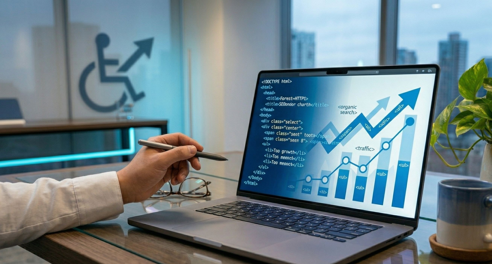
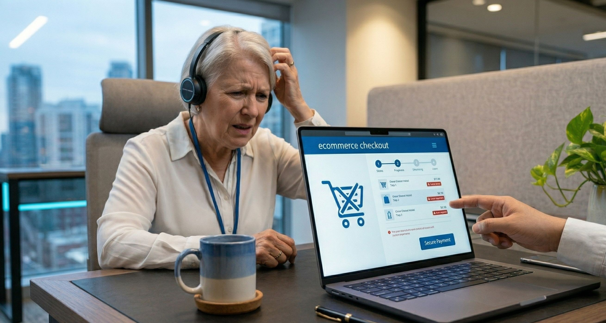

Cuando las empresas planifican el rediseño de su sitio web o el lanzamiento de un nuevo Ecommerce, las prioridades suelen ser claras: un diseño deslumbrante, integraciones rápidas y embudos de venta optimizados. Sin embargo, en medio de estas reuniones, hay un elemento crítico que se suele ignorar por considerarse un "extra" o algo que "solo afecta a una minoría": **la accesibilidad web**.

La accesibilidad web es la práctica de construir sitios que puedan ser utilizados por todas las personas, independientemente de sus capacidades visuales, auditivas, motoras o cognitivas. El gran mito del mundo corporativo es pensar que diseñar para la accesibilidad es un acto de pura caridad. La realidad es que es una **poderosa estrategia de negocio**.

> Según estudios globales de economía de la discapacidad, las personas con discapacidad y sus familias controlan más de 8 billones de dólares en ingresos disponibles a nivel mundial. Ignorar la accesibilidad significa, literalmente, cerrar la puerta de tu tienda en la cara de este inmenso mercado.

## Google es ciego (El impacto directo en tu SEO)

Muchos directores de marketing se sorprenden al descubrir que su mayor aliado en la optimización para motores de búsqueda (SEO) es, irónicamente, la accesibilidad. Para entender esto, hay que comprender cómo funciona Google.

Los "bots" o rastreadores de Google que analizan tu sitio web para decidir en qué posición aparecerá en los resultados de búsqueda no tienen ojos. No pueden apreciar la estética de tu paleta de colores ni entender la información de una imagen solo con "mirarla". **Los bots de Google leen tu sitio web exactamente de la misma manera que lo hace un lector de pantalla**, el software que utilizan las personas con discapacidad visual para navegar por internet.

Si tu sitio web utiliza una estructura de código limpia, encabezados lógicos (H1, H2, H3) y textos alternativos (`alt text`) que describen correctamente las imágenes, le estás facilitando la vida a un usuario ciego. Pero al mismo tiempo, le estás entregando a Google el contexto perfecto para que entienda de qué trata tu página y te posicione por encima de tu competencia. **Un código accesible es el pilar de un SEO técnico impecable.**

## Accesibilidad significa mejor experiencia para todos

En el mundo del diseño y la arquitectura existe algo llamado el "efecto rampa". Las rampas en las aceras se crearon originalmente para personas en sillas de ruedas, pero hoy benefician a padres con cochecitos de bebé, viajeros con maletas y repartidores. En el desarrollo web ocurre exactamente lo mismo: **diseñar para los extremos mejora la experiencia del usuario (UX) en el centro.**

Considera estos ejemplos cotidianos:
*   **Contraste de color adecuado:** Originalmente pensado para personas con baja visión o daltonismo, un buen contraste asegura que cualquier cliente potencial pueda leer las descripciones de tus productos mientras camina por la calle con el reflejo del sol en su móvil.
*   **Subtítulos en videos:** Esenciales para la comunidad sorda, pero también son la razón por la que el 80% de los usuarios ven videos en redes sociales hasta el final cuando están en el transporte público, en la oficina o sin auriculares.

Una experiencia fluida y sin fricciones reduce drásticamente la **tasa de rebote** (usuarios que abandonan tu web al instante) y aumenta el tiempo de permanencia, métricas que los motores de búsqueda adoran y que se traducen directamente en más conversiones.

## El riesgo oculto de un código pobre

Hoy en día es muy fácil levantar un sitio web utilizando plantillas genéricas o constructores visuales de arrastrar y soltar. El problema es que, debajo de esa fachada atractiva, estas herramientas suelen generar un código inflado, desordenado y, sobre todo, inaccesible.

Uno de los fallos más comunes en sitios mal construidos es la imposibilidad de realizar una **navegación por teclado**. Las personas con ciertas discapacidades motoras no usan un ratón; navegan saltando de un enlace a otro usando la tecla `Tab`. Si los botones de "Añadir al carrito" o los menús desplegables de tu Ecommerce no están programados para ser accesibles mediante el teclado, estás impidiendo físicamente que esos clientes te compren.

Además de la pérdida de ventas (el temido **abandono de carrito**), un código pobre te expone a riesgos legales. En muchos países, las leyes de accesibilidad digital son cada vez más estrictas, y las empresas se enfrentan a costosas demandas por tener plataformas que discriminan a usuarios con discapacidades.

### Es hora de construir para el futuro

La accesibilidad web no es un complemento que se añade al final de un proyecto; es un estándar de calidad que debe integrarse desde la primera línea de código. Hacer tu sitio web inclusivo mejora tu posicionamiento en Google, eleva la experiencia de todos tus usuarios, protege a tu empresa de riesgos legales y, lo más importante, abre tus puertas a un mercado masivo que tu competencia está ignorando.

**No dejes dinero sobre la mesa ni excluyas a clientes potenciales.** Si no estás seguro de si tu sitio web actual cumple con los estándares de accesibilidad, en nuestra agencia podemos ayudarte. Ofrecemos **auditorías técnicas profundas**, soporte especializado para optimizar sitios existentes, y el **desarrollo de plataformas web y Ecommerce 100% inclusivos desde cero**. 

Hablemos hoy y convirtamos tu sitio web en tu mejor herramienta de ventas, para *todos*.